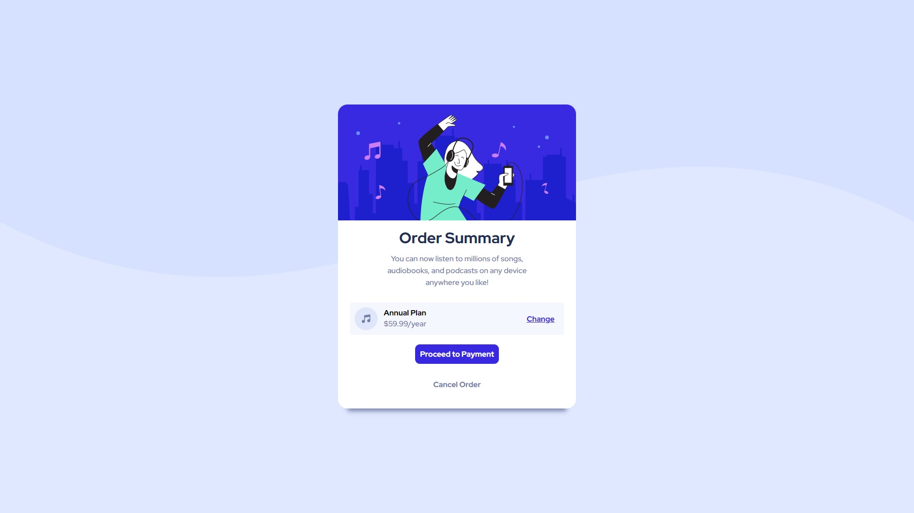

# Frontend Mentor - Order summary card solution

Esta es mi solucion al desafio [Order summary card challenge on Frontend Mentor](https://www.frontendmentor.io/challenges/order-summary-component-QlPmajDUj). Desafio donde busco desarrollar y ampliar mis habilidades construyendo proyectos reales.

## Tabla de contenido

- [Overview](#overview)
  - [El desafio](#El-desafio)
  - [Screenshot](#screenshot)
  - [Links](#links)
- [Mi proceso](#Mi-proceso)
  - [Con que se construyó](#Con-que-se-construyó)
  - [Que aprendí](#Que-aprendí)
- [Sobre mí](#Sobre-mí)
- [Correcciones](#Correcciones)


## Overview

### El desafio

Desarrollar habilidades de HTML y CSS:

- Replicar un proyecto desde 0 usando habilidades de programacion.

### Screenshot




### Links

- Solution URL: [Add solution URL here](https://github.com/HGMOS/Order-Sumary-Challenge)
- Live Site URL: [Add live site URL here](https://hgmos.github.io/Order-Sumary-Challenge/)

## Mi proceso

### Con que se construyó

- Semantic HTML5 markup
- CSS custom properties


### Que aprendí


```html
<h1>Implementacion basica de botones</h1>
```
```css
Mejores formas de dar estilo

```


## Sobre mí

- LinkedIn - [Add your name here](https://www.linkedin.com/in/hjgmos/)
- Frontend Mentor - [@yourusername](https://www.frontendmentor.io/profile/HGMOS)
- Twitter - [@yourusername](https://twitter.com/nacoro95)


## Correcciones 

Si encuentra algun error o cree que hay alguna forma de mejorar el codigo con gustó estaré abierto a opiniones y correciones. 
